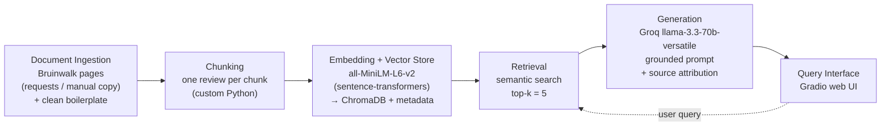

# Project 1 Planning: The Unofficial Guide

> Write this document before you write any pipeline code.
> Your spec and architecture diagram are what you'll use to direct AI tools (Claude, Copilot, etc.) to generate your implementation — the more specific they are, the more useful the generated code will be.
> Update the Retrieval Approach and Chunking Strategy sections if you change your approach during implementation.
> Update this file before starting any stretch features.

---

## Domain

Student reviews of **UCLA Computer Science professors and the courses they teach**, collected from [Bruinwalk](https://www.bruinwalk.com) — a student-run review site. This knowledge — which professor to take for CS 33, how heavy a class's workload really is, and whether a course's difficulty comes from the material or the grading — lives in scattered, anonymous reviews and is not captured anywhere official like the course catalog or the registrar's class descriptions. A retrieval system makes it answerable in plain language instead of forcing a student to read hundreds of individual reviews across dozens of professor pages.

---

## Documents

<!-- List your specific sources: URLs, subreddit names, forum threads, or file descriptions.
     Aim for at least 10 sources that together cover different subtopics or perspectives within your domain. -->

All sources are Bruinwalk professor-course review pages (each page = one professor teaching one course, holding many short student reviews). Selected for variety across the CS curriculum and across sentiment (beloved, polarizing, and disliked professors) so the corpus answers a range of questions rather than repeating the same praise. Reviews are paginated; append `?page=2`, `?page=3`, etc. to collect more.

| # | Source | Description | URL or location |
|---|--------|-------------|-----------------|
| 1 | Smallberg — CS 31 | Intro to CS I; flipped classroom, ~154 reviews, well-liked | https://www.bruinwalk.com/professors/david-a-smallberg/com-sci-31/ |
| 2 | Nachenberg — CS 32 | Intro to CS II; "one of the best at UCLA" | https://www.bruinwalk.com/professors/carey-nachenberg/com-sci-32/ |
| 3 | Nowatzki — CS 33 | Computer organization; beloved, generous curve | https://www.bruinwalk.com/professors/anthony-nowatzki/com-sci-33/ |
| 4 | Eggert — CS 33 | Computer organization; polarizing, brutal exams | https://www.bruinwalk.com/professors/paul-r-eggert/com-sci-33/ |
| 5 | Eggert — CS 35L | Software construction; heavy workload, mixed | https://www.bruinwalk.com/professors/paul-r-eggert/com-sci-35l/ |
| 6 | Sahai — CS 181 | Theory of computing; "best CS class at UCLA" | https://www.bruinwalk.com/professors/amit-sahai/com-sci-181/ |
| 7 | Meka — CS 181 | Theory of computing; whiteboard style, positive | https://www.bruinwalk.com/professors/raghu-meka/com-sci-181/ |
| 8 | Hsieh — CS 180 | Algorithms; "messy, hard to follow" (negative) | https://www.bruinwalk.com/professors/cho-jui-hsieh/com-sci-180/ |
| 9 | Burgin — CS 180 | Algorithms; detailed proofs, positive | https://www.bruinwalk.com/professors/mark-burgin/com-sci-180/ |
| 10 | Darwiche — CS 161 | Artificial intelligence; positive | https://www.bruinwalk.com/professors/adnan-darwiche/com-sci-161/ |
| 11 | Mirzasoleiman — CS 188 | ML special topics; clear pace, positive | https://www.bruinwalk.com/professors/baharan-mirzasoleiman/com-sci-188-7/ |
| 12 | Ercegovac — CS M51A | Logic design of digital systems | https://www.bruinwalk.com/professors/milos-d-ercegovac/com-sci-m51a/ |

---

## Chunking Strategy

<!-- How will you split documents into chunks?
     State your chunk size (in tokens or characters), overlap size, and explain why those
     numbers fit the structure of your documents.
     A review-heavy corpus warrants different chunking than a long FAQ. -->

**Chunk size:** One student review per chunk (variable length, typically ~150–800 characters). Reviews longer than ~800 characters are split at a sentence boundary so no single chunk becomes a diluted, multi-topic blob.

**Overlap:** None between separate reviews — each review is an independent, self-contained opinion, so there is nothing to "bridge." A ~1-sentence (~80-char) overlap is applied only in the rare case where one long review must be split, so the split halves stay coherent.

**Reasoning:** This is a review-style corpus, not long-form prose. Each Bruinwalk review is already a complete thought ("Eggert's exams are brutal but the curve is generous"), so the review boundary *is* the natural semantic boundary — splitting on a fixed character count would cut reviews mid-sentence and merge two different students' opinions into one chunk. Keeping one review per chunk maximizes how cleanly a query can match a specific opinion, and keeps each embedding focused on a single sentiment. Overlap, which exists to stop a key fact from being orphaned across a split, is mostly unnecessary here because reviews don't continue into each other. **Risk to watch:** very short reviews ("Great prof!") carry almost no semantic signal — if retrieval surfaces too many of these, we'll revisit by merging tiny adjacent reviews (the considered fallback) and update this section.

---

## Retrieval Approach

<!-- Which embedding model are you using (e.g., all-MiniLM-L6-v2 via sentence-transformers)?
     How many chunks will you retrieve per query (top-k)?
     If you were deploying this for real users and cost wasn't a constraint, what tradeoffs
     would you weigh in choosing a different embedding model — context length, multilingual
     support, accuracy on domain-specific text, latency? -->

**Embedding model:** `all-MiniLM-L6-v2` via `sentence-transformers`. Runs locally, no API key or rate limits, 384-dimensional embeddings, fast on CPU — well-suited to a corpus of short reviews where each chunk is small.

**Top-k:** 5. Each chunk is a single short review, so one chunk rarely tells the whole story; pulling 5 gathers a few independent opinions (helpful for "what do students generally say" consensus questions) while staying small enough not to flood the LLM with loosely-related reviews. Starting point per the spec — will tune in Milestone 4 against real retrieval results.

**Production tradeoff reflection:** If cost weren't a constraint and this served real students, I'd weigh:
- **Accuracy on domain-specific text:** MiniLM is a strong general-purpose model but isn't tuned for slangy, abbreviation-heavy student reviews ("psets," "the curve," course numbers like "CS33"). A larger or instruction-tuned embedding model (e.g. OpenAI `text-embedding-3-large`, Voyage, or a Cohere embed model) would likely separate fine-grained sentiment ("hard but fair" vs. "hard and unfair") better.
- **Context length:** Mostly irrelevant here — reviews are short, so MiniLM's ~256-token window is plenty. It would matter if I switched to long-form documents (syllabi, guides).
- **Latency vs. local control:** MiniLM running locally has zero network latency and no data leaving the machine (a privacy plus for anonymous reviews). An API model adds per-query latency and cost but offloads compute and usually improves quality — a real tradeoff at scale.
- **Multilingual support:** Not needed for an English-only UCLA corpus, but a multilingual model (e.g. `paraphrase-multilingual-MiniLM`) would matter for an international campus.

Net: MiniLM is the right call for this project; for production I'd most likely upgrade the embedding model for domain accuracy and benchmark it against MiniLM on my own eval set before paying for it.

---

## Evaluation Plan

<!-- List your 5 test questions with their expected correct answers.
     Questions should be specific enough that you can judge whether the system's response
     is right or wrong. "What are good dining halls?" is too vague.
     "What do students say about wait times at [dining hall name] during lunch?" is testable. -->

Expected answers below are drawn from the actual reviews visible on each Bruinwalk page (sampled while planning). Reconfirm them against the full collected text in Milestone 3 before using them to judge accuracy.

| # | Question | Expected answer |
|---|----------|-----------------|
| 1 | How difficult are Paul Eggert's exams in CS 33, and what do students recommend to prepare? | Extremely difficult (easiness ~1.4/5). Exams are open-note/open-book yet a midterm average was ~30%; they test both lecture and textbook material. Students strongly recommend reading the textbook before lectures and using office hours. |
| 2 | For CS 33, do students recommend Nowatzki or Eggert? | Overwhelmingly Nowatzki (overall ~4.3/5, helpfulness 4.6) over Eggert (~3.1/5). Nowatzki is praised for clear teaching and a very generous curve + extra credit ("nearly impossible to fail"); Eggert is seen as brilliant but punishing. |
| 3 | Is CS 35L (with Eggert) a heavy-workload class? | Yes — among the heaviest. Workload rated ~1.8/5; students call it "the most workload of any class by far" and "insane especially for the first 6 weeks." Common advice: start assignments early. |
| 4 | What do students say about Cho-Jui Hsieh's lecturing style in CS 180? | Mixed-to-negative (clarity ~3.2/5). He covers the needed material and states expectations clearly, but many find lectures messy, hard to follow (messy handwriting, accent, little structure), requiring heavy independent study — especially for dynamic programming. |
| 5 | Which professor is more recommended for CS 181 — Sahai or Meka? | Both are well-regarded, but Meka rates higher and is more universally recommended (~4.5/5, clarity 4.6, manageable workload, slow/methodical). Sahai (~4.2/5) is excellent for math/theory-oriented students but harder (easiness 2.2) and polarizing. Short answer: Meka for most students, Sahai for those wanting deep theory. |

---

## Anticipated Challenges

<!-- What could go wrong? Name at least two specific risks with reasoning.
     Consider: noisy or inconsistent documents, missing source attribution, off-topic
     retrieval, chunks that split key information across boundaries. -->

1. **Lopsided retrieval on comparison questions.** Questions like "Nowatzki or Eggert for CS 33?" (Q2) and "Sahai or Meka for CS 181?" (Q5) require balanced context about *two* professors. With one review per chunk, semantic search may return 4–5 chunks about the more-reviewed professor and none about the other, so the LLM gives a confident but one-sided answer. This is the most likely source of a documented failure case.

2. **Mixed sentiment getting flattened.** For genuinely divided opinions like Hsieh's CS 180 lectures (Q4), top-5 retrieval might surface only the positive or only the negative reviews, making the answer misrepresent the real spread. The retrieval is "correct" (on-topic) but unrepresentative.

3. **Low-signal and noisy chunks.** Very short reviews ("Great prof, take him!") embed to weak, generic vectors that can crowd out substantive reviews or add noise. Separately, scraped Bruinwalk text may carry boilerplate (rating labels, "would take again," nav text) that must be cleaned, or it pollutes chunks and embeddings.

---

## Architecture

<!-- Draw a diagram of your pipeline showing the five stages:
     Document Ingestion → Chunking → Embedding + Vector Store → Retrieval → Generation
     Label each stage with the tool or library you're using.
     You can use ASCII art, a Mermaid diagram, or embed a sketch as an image.
     You'll use this diagram as context when prompting AI tools to implement each stage. -->



Each chunk stored in ChromaDB carries metadata: `professor`, `course`, `source_url`, and the review's position on the page — used for source attribution in the final answer.

ASCII fallback (if Mermaid doesn't render):

```
[Bruinwalk pages] -> [Clean] -> [Chunk: 1 review each] -> [Embed: all-MiniLM-L6-v2]
   -> [ChromaDB store + metadata] -> [Retrieve top-5] -> [Groq LLM, grounded] -> [Gradio UI]
```

---

## AI Tool Plan

<!-- For each part of the pipeline below, describe:
     - Which AI tool you plan to use (Claude, Copilot, ChatGPT, etc.)
     - What you'll give it as input (which sections of this planning.md, which requirements)
     - What you expect it to produce
     - How you'll verify the output matches your spec

     "I'll use AI to help me code" is not a plan.
     "I'll give Claude my Chunking Strategy section and ask it to implement chunk_text()
     with my specified chunk size and overlap" is a plan. -->

**Milestone 3 — Ingestion and chunking:** Tool: Claude. Input: the **Documents** section (Bruinwalk URL pattern, that each page is one professor/course with many paginated reviews) and the **Chunking Strategy** section (one review per chunk, ~800-char cap, no inter-review overlap). I'll ask it to implement (a) a loader that reads saved Bruinwalk HTML/text and strips boilerplate (rating labels, "would take again," nav), and (b) a `chunk_reviews()` function that yields one chunk per review with `professor`/`course`/`source_url` metadata. Verify: print 5 chunks and confirm each is one self-contained review with correct metadata and no leftover HTML — per the Milestone 3 checkpoint.

**Milestone 4 — Embedding and retrieval:** Tool: Claude. Input: the **Retrieval Approach** section and the architecture diagram. I'll ask it to embed chunks with `all-MiniLM-L6-v2`, store them in ChromaDB with metadata, and write a `retrieve(query, k=5)` function returning chunks + source info + distance scores. Verify: run 3 of the 5 eval questions, print returned chunks and distances, and confirm top results are on-topic with distances below ~0.5 before adding generation. I expect to need to debug the lopsided-comparison risk here.

**Milestone 5 — Generation and interface:** Tool: Claude. Input: the grounding requirement (answer only from retrieved chunks; say "I don't have enough information" otherwise), the desired output format (answer + source list), and the Gradio skeleton from the instructions. I'll ask it to wire retrieval → Groq `llama-3.3-70b-versatile` with a grounded system prompt, append source attribution **programmatically** (not relying on the LLM), and build the Gradio UI. Verify: test an in-corpus query and an out-of-scope query, and read the prompt myself to confirm grounding is enforced, not merely suggested.
